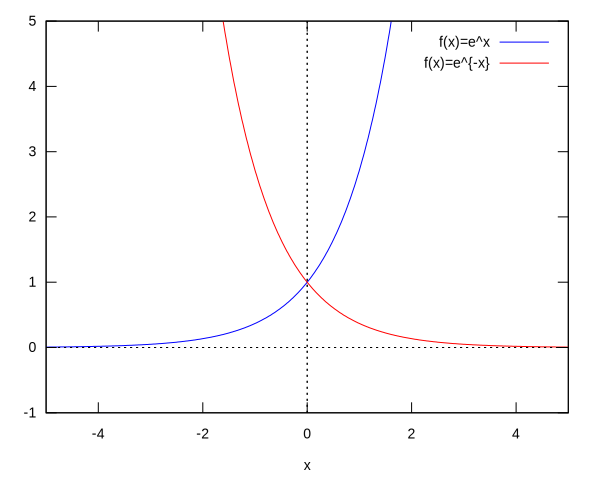
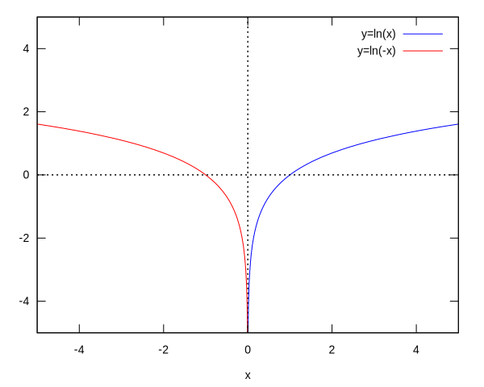

# Review of Functions

This is a quick run through of functions.

---

#### Definition of Function
A function $f$ is a rule of correspondence that associates with each element $x$ in one set $D$, called the domain, a single value of $f(x)$ from a second set, $R$. The set of all values obtained is called the range of the function.

---

#### Linear Function
A function whose graph is described as a line is called a linear function. Algebratically denoted

$$f(x)=mx+b=a_1 x + a_0$$

To expand from the previous definition we recall the following important definition.

#### Definition of Polynomials
A function $P$ is called a polynomial if

$$
P(x)=a_{n}x^{n}+a_{n-1}x^{n-1}+\cdots+a_{2}x^{2}+a_{1}x+a_{0}
$$

where $n$ is a non-negative integer and the numbers $a_{0},a_{1},...,a_{n}$
are constants called the coefficients of the polynomial.
The domain of any polynomial is $\mathbb{R}=\left\{ x\,|\,x\in(-\infty,\infty)\right\} $.
If the leading coefficient $a_{n}\ne0$, then the degree of the polynomial
is $n$.

#### Power Function
A function of the form

$$f(x)=x^a$$

where $a$ is a real number is called a power funciton.
* If $a=1,2,3,...$ we have a polynomial.
* If $a=\frac{1}{n}$ where $n=1,2,3,...$, then we say
$$f(x)=x^{\frac{1}{n}}=\sqrt[n]{x}$$ is a root function.
    * If $n$ is even then the domain of $f$ is $\{x|x\in[0,\infty)\}$.
    * If $n$ is odd then the domain of $f$ is $\{x|x\in(-\infty,\infty)\}$.
* If $a=-1,-2,-3,...$, then we say $$f(x)=x^a=\frac{1}{x^{-a}}$$ is the reciprocal function.
    * If $a=-1$, then we have $$f(x)=x^{-1}=\frac{1}{x^{-(-1)}}=\frac{1}{x^1}=\frac{1}{x}$$
* If $a=0$, then we say $$f(x)=x^0=1$$ is the constant function.

#### Absolute Value Function
The absolute value function is 

$$
|x|=\begin{cases}
x & \text{if} x\ge 0\\
-x & \text{if} x<0
\end{cases} = \sqrt[2]{x^2}
$$

#### Expoential Function
A function of the form $f(x)a^x$, where $a>0$ and $a\ne 1$, is called an exponential function with base $a$. The domain of the exponential function is $\{ x | x\in (-\infty,\infty) \}$ and the range is $\{ y | y\in (0,\infty) \}$.


```maxima
plot2d([exp(x),exp(-x)],[x,-5,5],[y,-1,5],[legend,"f(x)=e^x","f(x)=e^{-x}"]);
```


    

    


\[\tag{${\it \%o}_{1}$}\left[ \mbox{ /tmp/maxout170020.gnuplot } , \mbox{ /tmp/maxplot.svg } \right] \]


#### Logarithmic Function
A function of the form $f(x)=\log_{a}(x)$, where $a\ne1$ and $a>0$, is called a logarithmic function "log base a of x". The domain of the logarithmic function is $\{ x | x\in (0,\infty) \}$ and the range of $\{ y | y\in(-\infty,\infty) \}$. $$y=a^x \iff x=\log_a(y)$$


```maxima
plot2d([log(x),log(-x)],[x,-5,5],[y,-5,5],[legend,"y=ln(x)","y=ln(-x)"]);
```

    plot2d: expression evaluates to non-numeric value somewhere in plotting range.
    plot2d: expression evaluates to non-numeric value somewhere in plotting range.


    

    


\[\tag{${\it \%o}_{2}$}\left[ \mbox{ /tmp/maxout170020.gnuplot } , \mbox{ /tmp/maxplot.svg } \right] \]


